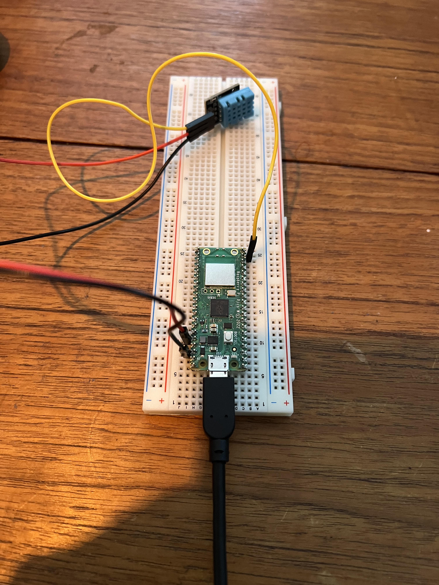

# Temperature and Humidity project

## Description
This IoT-project is a simple example of how to use a DHT11 sensor to measure temperature and humidity. The data is sent to Adafruit IO with MQTT protcol and can be viewed in a dashboard.

## Hardware
- Raspberry Pi Pico WH
- DHT11 sensor
- Breadboard
- Jumper wires

## Software
- Visual Studio Code
- MicroPython
- Adafruit IO account

## Pictures 

